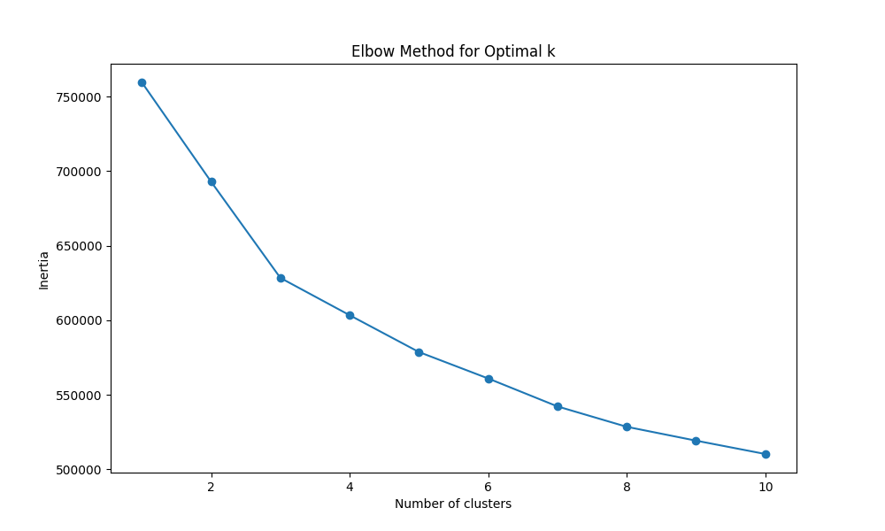

# IntelliPryce - Housing Price Prediction with Sentiment Analysis and Market Segmentation

## Project Overview

This project aims to develop a proof-of-concept predictive pricing model for new housing communities using synthetic data, enhanced by natural language processing (NLP) for sentiment analysis and clustering for market segmentation. The final deliverable is a FIGMA prototype demonstrating the potential of an interactive user interface for live price predictions and recommendations.

### Key Components
1. Synthetic Data Generation
2. NLP Sentiment Analysis
3. Predictive Pricing Model
4. Clustering Analysis
5. FIGMA Prototype (replacing originally planned interactive UI)

## Project Evolution and Key Decisions

### 1. Synthetic Data Generation
- **Tool Used**: CTGAN (Conditional Tabular Generative Adversarial Networks)
- **Dataset Size**: 250,000 rows
- **Key Decision**: Multiple iterations were required to ensure realistic correlations and distributions that matched real-world housing data scenarios. 
- [Synthetic Data Generation](notebooks/synthetic_data_generation.ipynb): Please refer to this notebook for more details & step-by-step approach to generation and iteration.
```py
# Refinement for DTI Distribution
def generate_dti_v4():
    dti = []
    for _ in range(250000):
        rand_val = np.random.rand()
        if rand_val < 0.7:
            dti.append(np.random.uniform(0, 0.45))
        elif rand_val < 0.9:
            dti.append(np.random.uniform(0.45, 0.55))
        else:
            dti.append(np.random.uniform(0.55, 0.85))
    return np.array(dti)

synthetic_data['DTI'] = generate_dti_v4()
```


*DTI Distribution*
### 2. NLP Sentiment Analysis
- **Tool Used**: VADER (Valence Aware Dictionary and sEntiment Reasoner)
- **Key Implementation**: Custom lexicon for domain-specific terms and refined scoring for mixed sentiments
- **Outcome**: Generated sentiment scores integrated into the main dataset for use in both supervised and unsupervised models

```py
def preprocess_text(text):
    # Convert to lowercase
    text = text.lower()
    
    # Remove special characters and digits
    text = re.sub(r'[^a-zA-Z\s]', '', text)
    
    # Tokenize
    tokens = word_tokenize(text)
    
    # Remove stopwords
    stop_words = set(stopwords.words('english'))
    tokens = [token for token in tokens if token not in stop_words]
    
    # Join tokens back into string
    cleaned_text = ' '.join(tokens)
    
    return cleaned_text
```

### 3. Predictive Pricing Model
- **Initial Approach**: Comprehensive pipeline using multiple models, scalers, and evaluation techniques
- **Models Explored**: Linear Regression, Ridge Regression, Lasso Regression, Random Forest, Gradient Boosting, Neural Network (Keras)
- **Scalers Tested**: Standard, Robust, MinMax
- **Key Decisions**:
  - Reduced from 250K to 50K samples due to computational constraints
  - Focused on MinMax scaler and Gradient Boosting Regressor based on initial results
  - Reduced cross-validation folds from 5 to 3 to balance thoroughness with efficiency
- **Final Model**: Gradient Boosting Regressor with hyperparameter tuning
- **Performance**: R2 Score: 0.8379, RMSE: 70,554.47


*Actual vs Predicted*

```
| Model      | MSE            | RMSE       | MAE        | R2       |
|------------|----------------|------------|------------|----------|
| GBR_MinMax | 4,977,933,939  | 70,554.47  | 56,170.09  | 0.83798  |
```
*Best model metrics*

```python
class DataPreprocessor:
    def __init__(self, random_state=42):
        self.random_state = random_state
        self.scaler = MinMaxScaler()

        # only using minmax now reduced model complexity, commenting out this.
        # self.scalers = {
        # "standard": StandardScaler(),
        # "robust": RobustScaler(),
        # "minmax": MinMaxScaler()
        # }
        self.categorical_encoder = None

    def load_data(self, filepath, sample_size=None):
        df = pd.read_csv(filepath)
        if sample_size and sample_size < len(df):
            return df.sample(n=sample_size, random_state=42)
        return df
```
*Sample datapreprocessor class definition and method*

### 4. Clustering Analysis
- **Algorithm**: K-means clustering
- **Key Decisions**:
  - Dropped hierarchical clustering due to computational intensity
  - Chose 5 clusters based on elbow method and interpretability
- **Outcome**: Identified 5 distinct market segments with a Silhouette Score of 0.08478412337466534


*Cluster Visualization*


*Elbow plot*

### 5. FIGMA Prototype (replacing Interactive UI)
- **Key Decision**: Shifted from full-fledged UI development to a FIGMA prototype due to time constraints and the proof-of-concept nature of the project
- **Purpose**: To demonstrate the potential of an interactive tool for price predictions and market segment insights

## Key Learnings and Future Directions

1. Balancing ambition with resource constraints is crucial in project management
2. Synthetic data generation requires careful iteration to mimic real-world patterns
3. Model selection and feature engineering significantly impact performance and efficiency
4. Clustering can provide valuable insights for market segmentation, even with limitations in data
5. Prototyping (e.g., FIGMA) can effectively demonstrate concept potential without full development

## Conclusion

This project serves as a proof of concept for integrating advanced machine learning techniques in the real estate domain. While using synthetic data and facing computational constraints, we've demonstrated the potential for accurate price prediction and meaningful market segmentation. The FIGMA prototype illustrates how these insights could be leveraged in a real-world application, setting the stage for future development with actual data and more extensive resources.

